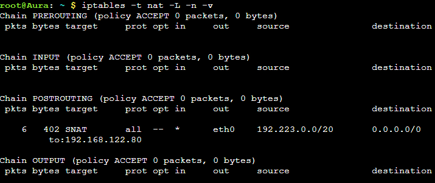
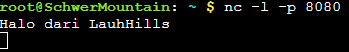

# Konfigurasi GNS3

## Anggota Kelompok

1. 5025211149 - Irsyad Fikriansyah Ramadhan
2. 5025211158 - Ghifari Maaliki Syafa Syuhada

| Kelompok | Prefix IP |
|----------|-----------|
| F04      | 192.223   |

## Table of Contents
- [Topologi](#Topologi)
- [Jawaban](###No.1)

## Topologi


## Pembagian IP

### Tabel Kebutuhan

Subnet| Kebutuhan host| Host tersedia| Usable host disediakan| Subnet mask|
|-|-|-|-|-|
A9| 1023| 2048| 2046| /21|
A10| 514| 1024| 1022| /22|
A4| 256| 512| 510| /23|
A3| 66| 128| 126| /25|
A1| 2| 4| 2| /30|
A2| 2| 4| 2| /30|
A5| 2| 4| 2| /30|
A6| 2| 4| 2| /30|
A7| 2| 4| 2| /30|
A8| 2| 4| 2| /30|
Total| 1871| 3736| 3734| /20|

### Pohon IP


### IP Subnet

Subnet| Nama| IP|
|-|-|-|
A1| Network ID| 192.223.14.128|
|| Netmask| 255.255.255.252|
|| Broadcast Address| 192.223.14.131|
A2| Network ID| 192.223.14.132|
|| Netmask| 255.255.255.252|
|| Broadcast Address| 192.223.14.135|
A3| Network ID| 192.223.14.0|
|| Netmask| 255.255.255.128 |
|| Broadcast Address| 192.223.14.127|
A4| Network ID| 192.223.12.0|
|| Netmask| 255.255.254.0|
|| Broadcast Address| 192.223.13.255|
A5| Network ID| 192.223.14.136|
|| Netmask| 255.255.255.252|
|| Broadcast Address| 192.223.14.139|
A6| Network ID| 192.223.14.140|
|| Netmask| 255.255.255.252|
|| Broadcast Address| 192.223.14.143|
A7| Network ID| 192.223.14.144|
|| Netmask| 255.255.255.252|
|| Broadcast Address| 192.223.14.147|
A8| Network ID| 192.223.14.148|
|| Netmask| 255.255.255.252|
|| Broadcast Address| 192.223.14.151|
A9| Network ID| 192.223.0.0|
|| Netmask| 255.255.248.0|
|| Broadcast Address| 192.223.7.255|
A10| Network ID| 192.223.8.0|
|| Netmask| 255.255.252.0|
|| Broadcast Address| 192.223.11.255|

## Konfigurasi GNS3

### Konfigurasi Router

* Aura
```sh
# ke NAT1
auto eth0
iface eth0 inet dhcp
up echo nameserver 192.168.122.1 > /etc/resolv.conf

# ke Heiter
auto eth1
iface eth1 inet static
address 192.223.14.149
netmask 255.255.255.252

# ke Frieren
auto eth2
iface eth2 inet static
address 192.223.14.141
netmask 255.255.255.252
```

* Heiter
```sh
# ke Aura
auto eth0
iface eth0 inet static
address 192.223.14.150
netmask 255.255.255.252
gateway 192.223.14.149
up echo nameserver 192.223.14.134 > /etc/resolv.conf

# ke TurkRegion
auto eth1
iface eth1 inet static
address 192.223.0.1
netmask 255.255.248.0

# ke Switch1
auto eth2
iface eth2 inet static
address 192.223.8.1
netmask 255.255.252.0
```

* Frieren
```sh
# ke Aura
auto eth0
iface eth0 inet static
address 192.223.14.142
netmask 255.255.255.252
gateway 192.223.14.141
up echo nameserver 192.223.14.134 > /etc/resolv.conf

# ke Stark
auto eth1
iface eth1 inet static
address 192.223.14.145
netmask 255.255.255.252

# ke Himmel
auto eth2
iface eth2 inet static
address 192.223.14.137
netmask 255.255.255.252
```

* Himmel
```sh
# ke LaubHills
auto eth0
iface eth0 inet static
address 192.223.12.1
netmask 255.255.254.0

# ke Frieren
auto eth1
iface eth1 inet static
address 192.223.14.138
netmask 255.255.255.252
gateway 192.223.14.137
up echo nameserver 192.223.14.134 > /etc/resolv.conf

# ke Switch3
auto eth2
iface eth2 inet static
address 192.223.14.1
netmask 255.255.255.128
```

* Fern
```sh
# ke Richter
auto eth0
iface eth0 inet static
address 192.223.14.133
netmask 255.255.255.252

# ke Switch3
auto eth1
iface eth1 inet static
address 192.223.14.2
netmask 255.255.255.128
gateway 192.223.14.1
up echo nameserver 192.223.14.134 > /etc/resolv.conf

# ke Switch2
auto eth2
iface eth2 inet static
address 192.223.14.129
netmask 255.255.255.252
```

### Konfigurasi Server

* Richter
```sh
# ke Fern
auto eth0
iface eth0 inet static
address 192.223.14.134
netmask 255.255.255.252
gateway 192.223.14.133
up echo nameserver 192.168.122.1 > /etc/resolv.conf
```

* Revolte
```sh
# ke Switch2
auto eth0
iface eth0 inet static
address 192.223.14.130
netmask 255.255.255.252
gateway 192.223.14.129
up echo nameserver 192.223.14.134 > /etc/resolv.conf
```

* Sein
```sh
# ke Switch1
auto eth0
iface eth0 inet static
address 192.223.8.2
netmask 255.255.255.252
gateway 192.223.8.1
up echo nameserver 192.223.14.134 > /etc/resolv.conf
```

* Stark
```sh
# ke Frieren
auto eth0
iface eth0 inet static
address 192.223.14.146
netmask 255.255.255.252
gateway 192.223.14.145
up echo nameserver 192.223.14.134 > /etc/resolv.conf
```

### Konfigurasi Client

* SchwerMountain
```sh
auto eth0
iface eth0 inet dhcp
```

* LaubHills
```sh
auto eth0
iface eth0 inet dhcp
```

* TurkRegion
```sh
auto eth0
iface eth0 inet dhcp
```

* GrobeForest
```sh
auto eth0
iface eth0 inet dhcp
```

### Routing 

* Aura
```sh
# kanan
route add -net 192.223.0.0 netmask 255.255.248.0 gw 192.223.14.150
route add -net 192.223.8.0 netmask 255.255.252.0 gw 192.223.14.150

# bawah 
route add -net 192.223.14.128 netmask 255.255.255.252 gw 192.223.14.142
route add -net 192.223.14.132 netmask 255.255.255.252 gw 192.223.14.142
route add -net 192.223.14.0 netmask 255.255.255.128 gw 192.223.14.142
route add -net 192.223.12.0 netmask 255.255.254.0 gw 192.223.14.142
route add -net 192.223.14.136 netmask 255.255.255.252 gw 192.223.14.142
route add -net 192.223.14.144 netmask 255.255.255.252 gw 192.223.14.142
```

* Frieren
```sh
# kiri
route add -net 192.223.14.128 netmask 255.255.255.252 gw 192.223.14.138
route add -net 192.223.14.132 netmask 255.255.255.252 gw 192.223.14.138
route add -net 192.223.14.0 netmask 255.255.255.128 gw 192.223.14.138
route add -net 192.223.12.0 netmask 255.255.254.0 gw 192.223.14.138
```

* Himmel
```sh
# bawah
route add -net 192.223.14.128 netmask 255.255.255.252 gw 192.223.14.2
route add -net 192.223.14.132 netmask 255.255.255.252 gw 192.223.14.2
```

### Konfigurasi DNS pada Ritcher

1. install `bind9`
2. konfigurasi `/etc/bind/named.conf.options`
4. jalankan `service bind9 restart`

* `/etc/bind/named.conf.options`:
    ```sh
    options {
        directory "/var/cache/bind";

        forwarders {
             192.168.122.1;
        };

        // dnssec-validation auto;
        allow-query{any;};

        listen-on-v6 { any; };
    };
    ```

### Konfigurasi DHCP

#### Pada Relay (`Aura`, `Fern`, `Frieren`, `Heiter`, `Himmel`)

1. install `isc-dhcp-relay`
2. konfigurasi `/etc/default/isc-dhcp-relay`
3. konfigurasi `/etc/sysctl.conf`
4. jalankan `service isc-dhcp-relay restart`

* `/etc/default/isc-dhcp-relay`:
    ```sh
    SERVERS="192.223.14.130"
    INTERFACES="{sesuaikan dengan interface masing-masing}"
    OPTIONS=
    ```
* `/etc/sysctl.conf`:
    ```sh
    net.ipv4.ip_forward=1
    ```

#### Pada Server (`Revolte`)

1. install `isc-dhcp-server`
2. konfigurasi `/etc/default/isc-dhcp-server`
3. konfigurasi `/etc/dhcp/dhcpd.conf`
4. jalankan `service isc-dhcp-server restart`

* `/etc/default/isc-dhcp-server`:
    ```sh
    INTERFACESv4="eth0"
    INTERFACESv6=""
    ```

* `/etc/dhcp/dhcpd.conf`:
    ```sh
    ddns-update-style none;
    option domain-name "example.org";
    option domain-name-servers 192.223.14.134;

    default-lease-time 600;
    max-lease-time 7200;

    authoritative;
    log-facility local7;

    # A1
    subnet 192.223.14.128 netmask 255.255.255.252 {
        option routers 192.223.14.129;
    }

    # A2
    subnet 192.223.14.132 netmask 255.255.255.252 {
        option routers 192.223.14.133;
    }

    # A3
    subnet 192.223.14.0 netmask 255.255.255.128 {
        range 192.223.14.4 192.223.14.126;
        option routers 192.223.14.1;
        option broadcast-address 192.223.14.127;
        option domain-name-servers 192.223.14.134;
    }

    # A4
    subnet 192.223.12.0 netmask 255.255.254.0 {
        range 192.223.12.3 192.223.13.254;
        option routers 192.223.12.1;
        option broadcast-address 192.223.13.255;
        option domain-name-servers 192.223.14.134;
    }

    # A5
    subnet 192.223.14.136 netmask 255.255.255.252 {
        option routers 192.223.14.137;
    }

    # A6
    subnet 192.223.14.140 netmask 255.255.255.252 {
        option routers 192.223.14.141;
    }

    # A7
    subnet 192.223.14.144 netmask 255.255.255.252 {
        option routers 192.223.14.145;
    }

    # A8
    subnet 192.223.14.148 netmask 255.255.255.252 {
        option routers 192.223.14.149;
    }

    # A9
    subnet 192.223.0.0 netmask 255.255.248.0 {
        range 192.223.0.3 192.223.7.254;
        option routers 192.223.0.1;
        option broadcast-address 192.223.7.255;
        option domain-name-servers 192.223.14.134;
    }

    # A10
    subnet 192.223.8.0 netmask 255.255.252.0 {
        range 192.223.8.4 192.223.11.254;
        option routers 192.223.8.1;
        option broadcast-address 192.223.11.255;
        option domain-name-servers 192.223.14.134;
    }
    ```

## Pengerjaan Soal

### No.1

> Agar topologi yang kalian buat dapat mengakses keluar, kalian diminta untuk mengkonfigurasi Aura menggunakan iptables, tetapi tidak ingin menggunakan MASQUERADE.

<hr style="width:60%; align:center">

Di `Aura` jalankan:

```sh
IPETH0="$(ip -br a | grep eth0 | awk '{print $NF}' | cut -d'/' -f1)"
iptables -t nat -A POSTROUTING -o eth0 -j SNAT -s 192.223.0.0/20 --to-source "$IPETH0"
```
penjelasan:
```sh
IPETH0="$(ip -br a | grep eth0 | awk '{print $NF}' | cut -d'/' -f1)"
```
* `ip -br a`: Menampilkan versi singkat dari `ip a`.
* `grep eth0`: Menampilkan output yang memiliki `eth0` pada stringnya.
* `awk '{print $NF}'`: Menampilkan kolom terakhir dari baris yang dipilih.
* `cut -d'/' -f1`: Menghapus string mulai dari char `/`.
* `IPETH0`: Variabel yang menyimpan hasilnya.

```sh
iptables -t nat -A POSTROUTING -o eth0 -j SNAT -s 192.223.0.0/20 --to-source "$IPETH0"
```

* `iptables -t nat`: Perintah untuk mengonfigurasi tabel nat.
* `-A POSTROUTING`: Menambahkan aturan pada chain POSTROUTING.
* `-o eth0`: Menentukan antarmuka keluar, yaitu "eth0".
* `-j SNAT`: Menunjukkan bahwa tindakan yang diambil adalah Source NAT (SNAT), yaitu mengganti alamat sumber paket.
* `-s 192.223.0.0/20`: Mmenentukan jangkauan source IP yaitu `192.223.0.0/20`
* `--to-source "$IPETH0"`: Menentukan alamat IP yang akan digunakan sebagai alamat sumber setelah paket melalui aturan SNAT. Nilai ini diambil dari variabel `IPETH0` yang telah diisi sebelumnya.

#### Testing :
Jalankan command diatas pada `Aura`, cek dengan menggunakan command `iptables -t nat -L -n -v`



Setelah itu, coba jalankan command `ping google.com` untuk memeriksa apakah node tersebut sudah tehubung dengan internet atau belum. Disini kami memeriksa pada node `SchwerMountain`


### No.2

> Kalian diminta untuk melakukan drop semua TCP dan UDP kecuali port 8080 pada TCP.

<hr style="width:60%; align:center">

Di `SchwerMountain` jalankan:

```sh
iptables -A INPUT -p tcp --dport 8080 -j ACCEPT
iptables -A INPUT -p tcp -j DROP
iptables -A INPUT -p udp -j DROP
```
penjelasan:
```sh
iptables -A INPUT -p tcp --dport 8080 -j ACCEPT
```
* `-A INPUT`: Menambahkan aturan pada chain INPUT (masukan).
* `-p tcp`: Menentukan protokol untuk aturan tersebut, dalam hal ini, TCP.
* `--dport 8080`: Membatasi aturan untuk paket yang menuju ke port 8080.
* `-j ACCEPT`: Paket yang sesuai dengan aturan ini harus diterima (ACCEPT).

```sh
iptables -A INPUT -p tcp -j DROP
```
* `-p tcp`: Menentukan bahwa aturan ini berlaku untuk paket dengan protokol TCP.
* `-j DROP`: Paket yang sesuai dengan aturan ini harus ditolak (DROP). Dengan kata lain, aturan ini secara efektif menolak semua paket TCP yang mencapai sistem, kecuali jika ada aturan yang lebih awal yang mengizinkan (ACCEPT) paket tersebut.

```sh
iptables -A INPUT -p udp -j DROP
```
* `-p udp`: Menentukan bahwa aturan ini berlaku untuk paket dengan protokol UDP.
* `-j DROP`: Paket yang sesuai dengan aturan ini harus ditolak (DROP). Dengan kata lain, aturan ini secara efektif menolak semua paket UDP yang mencapai sistem, kecuali jika ada aturan yang lebih awal yang mengizinkan (ACCEPT) paket tersebut.

#### Testing :
Jalankan command diatas pada `SchwerMountain`, cek dengan menggunakan command `iptables -L`


Kita dapat melihat efek dari command tersebut dengan menggunakan `netcat`

- Jalankan perintah `nc -l -p 8080` untuk melakukan listen pada TCP dengan port 8080
- Lalu gunakan node lain untuk mengirim pesan dengan netcat juga. Jalankan perintah `nc [ip-SchwerMountain] 8080` untuk terhubung dengan `SchwerMountain`. Karena ip dari `SchwerMountain` bersifat dinamis, maka perlu dicek dulu ip-nya

Hasil :

`LaubHills`


`SchwerMountain`



- Jalankan perintah `nc -u -l -p 8080` untuk melakukan listen pada UDP dengan port 8080
- Lalu gunakan node lain untuk mengirim pesan dengan netcat juga. Jalankan perintah `nc -u [ip-SchwerMountain] 8080` untuk terhubung dengan `SchwerMountain`. Karena ip dari `SchwerMountain` bersifat dinamis, maka perlu dicek dulu ip-nya

Hasil :

`LaubHills`


`SchwerMountain`


### No.3

> Kepala Suku North Area meminta kalian untuk membatasi DHCP dan DNS Server hanya dapat dilakukan ping oleh maksimal 3 device secara bersamaan, selebihnya akan di drop.

<hr style="width:60%; align:center">

Di DHCP (`Revolt`) dan DNS (`Richter`) jalankan:

```sh
iptables -A INPUT -p icmp -m connlimit --connlimit-above 3 --connlimit-mask 0 -j DROP
```

penjelasan:
* `iptables:` Perintah untuk mengonfigurasi tabel filter pada iptables.
* `-A INPUT`: Menambahkan aturan pada chain INPUT (masukan).
* `-p icmp`: Menentukan protokol untuk aturan tersebut, dalam hal ini, ICMP. Ini akan mempengaruhi paket-paket kontrol jaringan seperti ping.
* `-m connlimit`: Menggunakan modul connlimit, yang memungkinkan Anda untuk mengenakan pembatasan koneksi pada aturan tertentu.
* `--connlimit-above 3`: Menetapkan batas atas koneksi yang diizinkan. Aturan ini akan memblokir paket ICMP jika jumlah koneksi ICMP dari satu sumber melebihi 3.
* `--connlimit-mask 0`: Mengatur pembatasan koneksi berdasarkan alamat IP tunggal, mengabaikan subnet. Nilai 0 di sini mengindikasikan bahwa seluruh alamat IP harus dihitung bersama-sama, tidak memandang perbedaan subnet.
* `-j DROP`: Ini menunjukkan bahwa paket yang sesuai dengan aturan ini harus ditolak (DROP).

#### Testing : 
Jalankan command diatas pada DHCP dan DNS Server yaitu `Revolte` dan `Richter`, cek dengan menggunakan command `iptables -L`

`Revolte`


`Richter`


Untuk memeriksa apakah sudah benar, dapat dilakukan dengan melakukan ping dari 4 host sekaligus. Apabila dilakukan ping pada host keempat, maka seharusnya akan mengalami packet loss. Pada testing kali ini, ping yang dilakukan adalah ping ke `Richter`

- Ping dari `Sein`


- Ping dari `GrobeForest`


- Ping dari `TurkRegion`


- Ping dari `Stark`


### No.4

> Lakukan pembatasan sehingga koneksi SSH pada Web Server hanya dapat dilakukan oleh masyarakat yang berada pada GrobeForest.

<hr style="width:60%; align:center">

Di WebServer (`Stark` dan `Sein`) jalankan:

```sh
iptables -A INPUT -p tcp --dport 22 -s 192.223.8.0/22 -j ACCEPT
```

penjelasan:
* `-A INPUT`: Menambahkan aturan pada chain INPUT (masukan).
* `-p tcp`: Menentukan protokol untuk aturan tersebut, dalam hal ini, TCP.
* `--dport 22`: Membatasi aturan untuk paket yang menuju ke port 22 (port SSH).
* `-s 192.223.8.0/22`: Menetapkan batasan sumber IP, yaitu subnet A10 (`GrobeForest`)
* `-j ACCEPT`: Paket yang sesuai dengan aturan ini harus diterima (ACCEPT).
* 
Selain itu, kita juga perlu DROP koneksi SSH yang lain. Maka setelah melakukan perintah tersebut, jalankan:

```sh
iptables -A INPUT -p tcp --dport 22 -j DROP
```

penjelasan:
* `-j DROP` : Paket yang sesua dengan aturan akan ditolak (DROP).


### No.5

> Selain itu, akses menuju WebServer hanya diperbolehkan saat jam kerja yaitu Senin-Jumat pada pukul 08.00-16.00.

<hr style="width:60%; align:center">

Di WebServer (`Stark` dan `Sein`) jalankan:

```sh
iptables -A INPUT -p tcp --dport 22 -m time --timestart 08:00 --timestop 16:00 --weekdays Mon,Tue,Wed,Thu,Fri -s 192.223.8.0/22 -j ACCEPT
iptables -A INPUT -p tcp --dport 22 -j DROP
```

penjelasan:

```sh
iptables -A INPUT -p tcp --dport 22 -m time --timestart 08:00 --timestop 16:00 --weekdays Mon,Tue,Wed,Thu,Fri -s 192.223.8.0/22 -j ACCEPT
```

* `-A INPUT`: Menambahkan aturan pada chain INPUT (masukan).
* `-p tcp`: Menentukan protokol untuk aturan tersebut, dalam hal ini, TCP.
* `--dport 22`: Membatasi aturan untuk paket yang menuju ke port 22 (port SSH).
* `-m time --timestart 08:00 --timestop 16:00 --weekdays Mon,Tue,Wed,Thu,Fri`: Menggunakan modul waktu untuk menetapkan batasan waktu ketika aturan tersebut berlaku. Dengan konfigurasi ini, aturan hanya berlaku pada hari Senin hingga Jumat, mulai dari pukul 08:00 hingga 16:00.
* `-s 192.223.8.0/22`: Menetapkan batasan sumber IP, yaitu subnet A10 (`GrobeForest`)
* `-j ACCEPT`: Paket yang sesuai dengan aturan ini harus diterima (ACCEPT).

```sh
iptables -A INPUT -p tcp --dport 22 -j DROP
```

* `-A INPUT`: Menambahkan aturan pada chain INPUT (masukan).
* `-p tcp`: Menentukan protokol untuk aturan tersebut, dalam hal ini, TCP.
* `--dport 22`: Membatasi aturan untuk paket yang menuju ke port 22 (port SSH).
* `-j DROP`: Menetapkan tindakan yang harus diambil jika paket sesuai dengan aturan ini, yaitu menolak (DROP).


### No.6

> Lalu, karena ternyata terdapat beberapa waktu di mana network administrator dari WebServer tidak bisa stand by, sehingga perlu ditambahkan rule bahwa akses pada hari Senin - Kamis pada jam 12.00 - 13.00 dilarang (istirahat maksi cuy) dan akses di hari Jumat pada jam 11.00 - 13.00 juga dilarang (maklum, Jumatan rek).

<hr style="width:60%; align:center">

Di WebServer (`Stark` dan `Sein`) jalankan:

```sh
iptables -A INPUT -p tcp --dport 22 -m time --timestart 12:00 --timestop 13:00 --weekdays Mon,Tue,Wed,Thu -j DROP
iptables -A INPUT -p tcp --dport 22 -m time --timestart 11:00 --timestop 13:00 --weekdays Fri -j DROP
```

Penjelasan:

```sh
iptables -A INPUT -p tcp --dport 22 -m time --timestart 12:00 --timestop 13:00 --weekdays Mon,Tue,Wed,Thu -j DROP
```

* `-A INPUT`: Menambahkan aturan pada chain INPUT (masukan).
* `-p tcp`: Menetapkan protokol TCP.
* `--dport 22`: Membatasi aturan untuk paket yang menuju ke port 22 (port SSH).
* `-m time --timestart 12:00 --timestop 13:00 --weekdays Mon,Tue,Wed,Thu`: Menggunakan modul waktu untuk membatasi aturan hanya berlaku pada waktu tertentu dan pada hari Senin hingga Kamis, mulai dari pukul 12:00 hingga 13:00.
* `-j DROP`: Menetapkan tindakan yang harus diambil jika paket sesuai dengan aturan ini, yaitu menolak (DROP).

```sh
iptables -A INPUT -p tcp --dport 22 -m time --timestart 11:00 --timestop 13:00 --weekdays Fri -j DROP
```

* `-A INPUT`: Menambahkan aturan pada chain INPUT (masukan).
* `-p tcp`: Menetapkan protokol TCP.
* `--dport 22`: Membatasi aturan untuk paket yang menuju ke port 22 (port SSH).
* `-m time --timestart 11:00 --timestop 13:00 --weekdays Fri`: Menggunakan modul waktu untuk membatasi aturan hanya berlaku pada waktu tertentu dan pada hari Jumat, mulai dari pukul 11:00 hingga 13:00.
* `-j DROP`: Menetapkan tindakan yang harus diambil jika paket sesuai dengan aturan ini, yaitu menolak (DROP).


### No.7

> Karena terdapat 2 WebServer, kalian diminta agar setiap client yang mengakses Sein dengan Port 80 akan didistribusikan secara bergantian pada Sein dan Stark secara berurutan dan request dari client yang mengakses Stark dengan port 443 akan didistribusikan secara bergantian pada Sein dan Stark secara berurutan.

<hr style="width:60%; align:center">


### No.8

> Karena berbeda koalisi politik, maka subnet dengan masyarakat yang berada pada Revolte dilarang keras mengakses WebServer hingga masa pencoblosan pemilu kepala suku 2024 berakhir. Masa pemilu (hingga pemungutan dan penghitungan suara selesai) kepala suku bersamaan dengan masa pemilu Presiden dan Wakil Presiden Indonesia 2024.

<hr style="width:60%; align:center">

Di WebServer (`Stark` dan `Sein`) jalankan:

```sh
iptables -A INPUT -p tcp --dport 80 -s 192.223.14.128/30 -m time --datestart 2023-12-10 --datestop 2024-02-15 -j DROP
```

Penjelasan:
* `-A INPUT`: Menambahkan aturan pada chain INPUT (masukan).
* `-p tcp`: Menetapkan protokol TCP.
* `--dport 80`: Membatasi aturan untuk paket yang menuju ke port 80 (port HTTP).
* `-s 192.223.14.128/30`: Menentukan alamat sumber (source).
* `-m time --datestart 2023-12-10 --datestop 2024-02-15`: Menentukan aturan berdasarkan waktu. Aturan ini hanya berlaku untuk paket-paket yang diterima antara tanggal 10 Desember 2023 dan 15 Februari 2024.
* `-j DROP`: Menetapkan tindakan yang harus diambil jika paket sesuai dengan aturan ini, yaitu menolak (DROP).

### No.9

> Sadar akan adanya potensial saling serang antar kubu politik, maka WebServer harus dapat secara otomatis memblokir  alamat IP yang melakukan scanning port dalam jumlah banyak (maksimal 20 scan port) di dalam selang waktu 10 menit. <br>
> (clue: test dengan nmap)

<hr style="width:60%; align:center">

Di WebServer (`Stark` dan `Sein`) jalankan:

```sh
iptables -N scan_port
iptables -A INPUT -m recent --name scan_port --update --seconds 600 --hitcount 20 -j DROP
iptables -A FORWARD -m recent --name scan_port --update --seconds 600 --hitcount 20 -j DROP
iptables -A INPUT -m recent --name scan_port --set -j ACCEPT
iptables -A FORWARD -m recent --name scan_port --set -j ACCEPT
```

Penjelasan:

```sh
iptables -N scan_port
```

* Membuat chain baru dengan nama "scan_port". Chain ini akan digunakan untuk mengelola aturan-aturan terkait perlindungan terhadap pemindaian port.

```sh
iptables -A INPUT -m recent --name scan_port --update --seconds 600 --hitcount 20 -j DROP
```

* Menambahkan aturan pada chain INPUT. Aturan ini menggunakan modul "recent" untuk melacak aktivitas baru-baru ini. 
* Jika ada lebih dari 20 paket yang masuk dalam waktu 600 detik (10 menit), maka paket-paket tersebut akan ditolak (DROP).

```sh
iptables -A FORWARD -m recent --name scan_port --update --seconds 600 --hitcount 20 -j DROP
```

* Menambahkan aturan yang sama pada chain FORWARD.

```sh
iptables -A INPUT -m recent --name scan_port --set -j ACCEPT
```

* Menambahkan aturan pada chain INPUT. Aturan ini mengatur kondisi yang memungkinkan paket-paket masuk untuk diizinkan (ACCEPT) dan menyetel pelacakan "recent" ke status "set". Ini berarti setiap kali paket masuk, sistem akan mencatatnya sebagai aktivitas baru.

```sh
iptables -A FORWARD -m recent --name scan_port --set -j ACCEPT
```

* Menambahkan aturan pada chain FORWARD. Serupa dengan aturan sebelumnya, aturan ini mengizinkan paket-paket yang melewati sistem dan menyetel pelacakan "recent" ke status "set".


### No.10

> Karena kepala suku ingin tau paket apa saja yang di-drop, maka di setiap node server dan router ditambahkan logging paket yang di-drop dengan standard syslog level. 

<hr style="width:60%; align:center">


